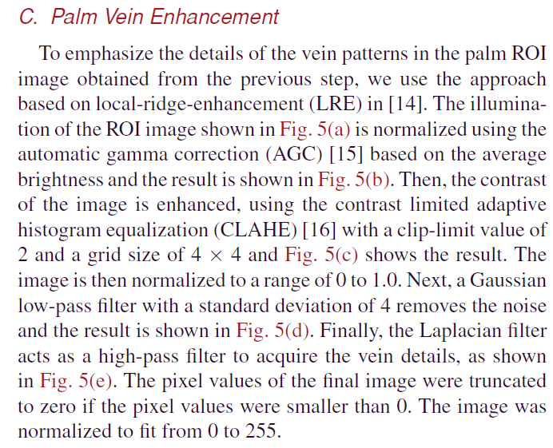
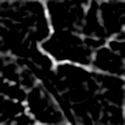

# Palm-Vein-Enhancement

## 簡介
程式練習...

參考資料如下:

1. IEEE TRANSACTIONS ON INDUSTRIAL INFORMATICS: [Recognizing Palm Vein in Smartphones Using RGB Images](https://ieeexplore.ieee.org/document/9648012)

---

## 靜脈影像增強演算法

---

## 實際測試結果

 

---

## 使用方法

替換為想測試的圖片後，直接執行 `vein_enhancement.ipynb` 

---

## Requirements

python==3.9.2

opencv-python==4.5.3.56

numpy==1.26.4

matplotlib==3.8.0
